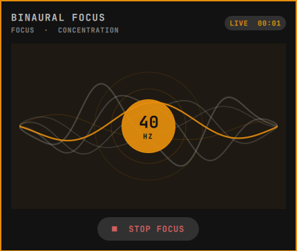

# Binaural Focus for Omarchy

A one-click, fully offline 40 Hz binaural player for the Omarchy Quattro bar. It includes a seven-bar status icon, a calm animated control panel, a session timer, and IPC controls.

The bundled sound is original and mathematically generated—no recordings or samples are used. The left channel carries a 134 Hz sine wave and the right channel carries a 174 Hz sine wave, creating a 40 Hz binaural difference. A compact five-minute Opus asset loops continuously during longer sessions.

Use stereo headphones, start at a low system volume, and increase it only to a comfortable level. Binaural tones are a personal focus aid, not medical treatment, and perceived effects vary.



## Install

Install and enable the plugin from its GitHub repository:

```bash
omarchy plugin add https://github.com/elgevan/omarchy-binaural-focus.git --enable
```

For a local checkout:

```bash
omarchy plugin add /path/to/omarchy-binaural-focus --enable
```

The widget defaults to the right side of the bar. Move it with `omarchy bar move` if desired.

## Use

- Left-click the waveform to start or stop playback.
- Right-click to open or close the visualizer.
- Middle-click to stop immediately.
- In the panel, press Space, Enter, or `P` to start or stop.
- Press Escape to close the panel without stopping playback.

IPC is also available:

```bash
omarchy-shell io.github.elgevan.binaural-focus play
omarchy-shell io.github.elgevan.binaural-focus stop
omarchy-shell io.github.elgevan.binaural-focus toggle
omarchy-shell io.github.elgevan.binaural-focus status
```

## Update

```bash
omarchy plugin update io.github.elgevan.binaural-focus
```

## Remove

```bash
omarchy plugin remove io.github.elgevan.binaural-focus
```

Removal deletes the plugin checkout and its bundled audio. The plugin does not create configuration files, accounts, caches, or persistent background services.

## Requirements

- Omarchy 4 with Quattro shell plugin support
- `mpv`, included in the standard Omarchy installation
- Stereo headphones for the intended binaural effect

`ffmpeg` is only needed by maintainers who regenerate the audio asset.

## Regenerate the audio

The committed audio is generated by an auditable source recipe:

```bash
./tools/generate-audio.sh
```

Set `DURATION_SECONDS` to create a different loop length. Keep it at a whole number of seconds so both integer-frequency carriers meet the loop boundary at the same phase.

## Privacy and security

Playback is local and offline. The plugin starts only the bundled `mpv` player, makes no network requests, and stores no user data.

## License

- Plugin code and documentation: MIT; see [`LICENSE`](LICENSE).
- Generated audio and plugin-authored preview artwork: CC0-1.0; see [`LICENSES/CC0-1.0.txt`](LICENSES/CC0-1.0.txt).

See [`NOTICE.md`](NOTICE.md) for asset provenance and licensing scope.
